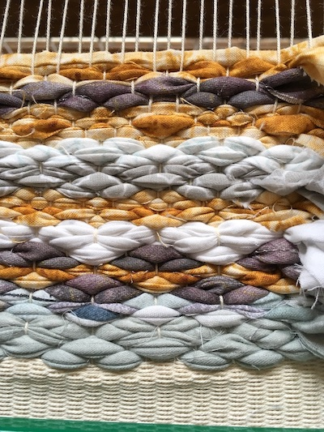
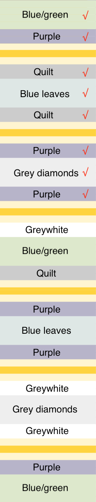
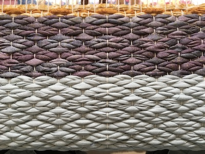

Back to [2020 Rugs main page](2020-rugs.html) and [2020 Rug fabric](2020-rugs-1.html)

## Sampling
{: .center-image }

## Progress
* 6 Apr 2020: heading started: 23 rows (0.5 in) + 1 row sumac + 38 rows (0.75 in)

	<h2>Schematic</h2>
	
	
	<h2>Fabric weights</h2>
	<ul>
		<li>Purple 5301 sq.in./865 g = 6.13 sq.in./g → 1</li>
		<li>Blue/green 6734/685 = 9.83 sq.in./g → 1.5</li>
		<li>Blue leaves 7980/653 = 12.22 sq.in./g → 2</li>
		<li>Quilt 8010/453 = 17.68 sq.in./g → 2.5</li>
		<li>Diamonds 5818/444 = 13.10sq.in./g → 2</li>			
		<li>Orange 2968/315 = 9.42sq.in./g → 1.5</li>
	</ul>

	<h3>Width of fabric strips</h3>
	<ul>
		<li>Purple 0.75 in</li>
		<li>Blue/green 1.0 in</li>
		<li>Blue leaves 1.5 in</li>
		<li>Quilt 1.75</li>
		<li>Diamonds 2.0 in</li>
		<li>Orange 1.0 in</li>
	</ul>
	
	Weaving started with Blue/green fabric. After 3.14 in, 609 g remaining.
	
	
<code>
		685-609 = 78g used
		
		76g/3.14in = 24.2 g/in
	</code>

	
	<h3>Amounts of fabric needed:</h3>
	<ul>
		<li>Blue leaves, 653g/24.2 → 27 in of weaving, only 13.2 in needed</li>
		<li>Quilt, 453/24.2 → 18.7 in, 8.8 in needed</li>
		<li>For orange borders, 3 picks = 5/16 in. 6 borders = 1.875 in</li>
	</ul>
		
	Total rug length = (7 x 4.4) + (12 x 2.2) + 1.875 = 59 in
	

### Number of picks per section
* Blue/green, 4.4 inches, 55 picks
* Purple, 2.2 inches, 25 picks
* Quilt, 2.2 inches, 25 picks
* Blue leaves, 4.4 inches, 48 picks
* Diamonds, 4.4 inches, 39 picks

{: .center-image }

Finished 27 Jun 2020