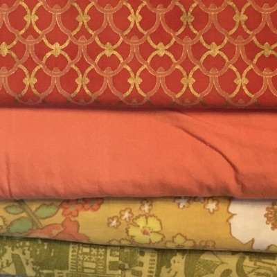

Back to [2020 Rugs main page](2020-rugs.html)

The [Rosepath Twill Rug](../rosepath-twill/rosepath-twill.html) from 2017 is 2315 g = 81.65 oz /16 = 5.1 lb. Roughly 0.5 of this is seine twine, suggesting ~4.5 lb (2043 g) of fabric is needed.

 

<table>
	<tr><td>Peach sheet</td><td>446 g / 31.2 sq ft = 14.3 g/sq ft</td></tr>
	<tr><td>Byzantine</td>141 g / 24.4 sq ft = 5.8 g/sq ft</td></tr>
	<tr><td>Flowers</td> 441 g / 40 sq ft = 11.0 g/sq ft</td>
		<td><td>Peach-sheet.jpg" /> 377 g / 36.9 sq ft = 10.2 g/sq ft</td></tr>
</table>