[Back to 2020 rugs](2020-rugs.html)

## Rug 1
<table>
	<tr><td>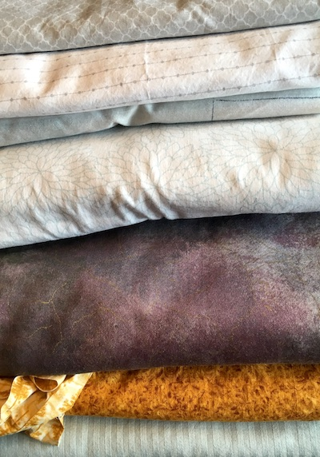</td><td>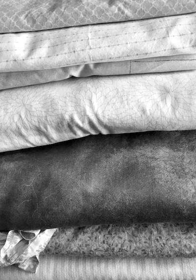</td></tr>
</table>

## Rug 2
[Rug 2 homepage](2020-rugs-2.html)
<table>
	<tr><td></td><td></td></tr>
	<tr><td>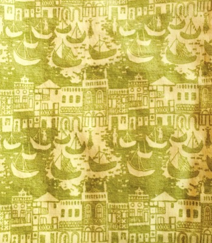 446 g / 31.2 sq ft = 14.3 g/sq ft</td>
	<td>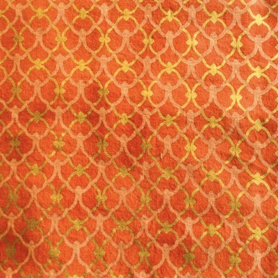 141 g / 24.4 sq ft = 5.8 g/sq ft</td></tr>
	<tr><td>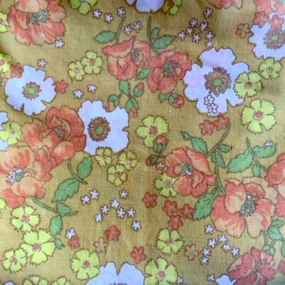 441 g / 40 sq ft = 11.0 g/sq ft</td>
	<td>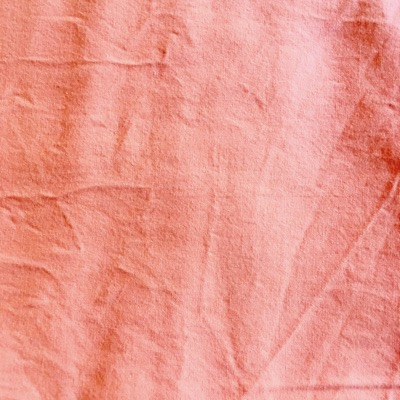 377 g / 36.9 sq ft = 10.2 g/sq ft</td></tr>
	<tr><td> 755 g /  sq ft = g/sq ft</td>
</table>

## Rug 3
[Rug 3 homepage](2020-rugs-3.html)
<table>
	<tr><td></td><td></td></tr>
	<tr><td>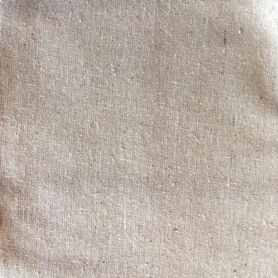 118 g / 7.96 sq ft = 14.8 g/sq ft</td>
	<td>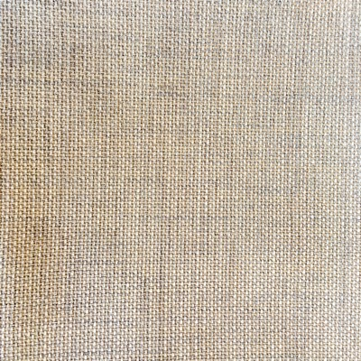 254 g / 12.0 sq ft = 21.2 g/sq ft</td></tr>
	<tr><td> 358 g / 15.16 sq ft = 23.6 g/sq ft</td>
	<td>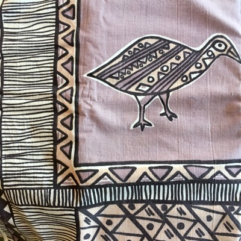 486 g 23.8 sq ft = 20.4 g/sq ft</td></tr>
	<tr><td>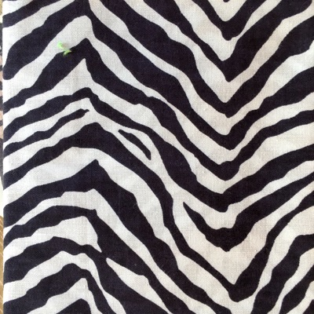 391 g / 24.1 sq ft = 16.2 g/sq ft</td></tr>
</table>

## Rug 4
[Rug 4 homepage](2020-rugs-4.html)
<table>
	<tr><td>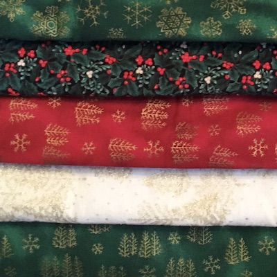</td><td></td></tr>
	<tr><td>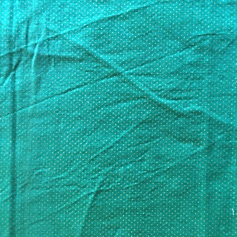 127 g / 11.0 sq ft = 11.5 g/sq ft</td>
	<td>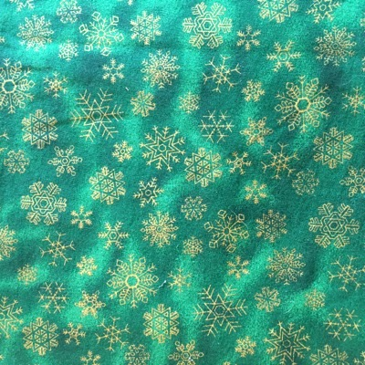 69 g / 39.4 sq ft = 211.9 g/sq ft</td></tr>
	<tr><td>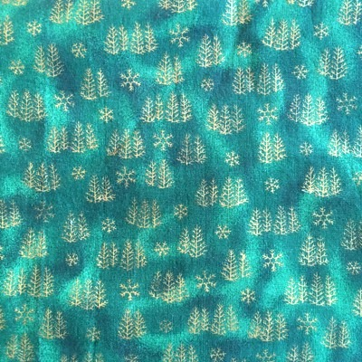 510 g / sq ft = g/sq ft</td>
	<td>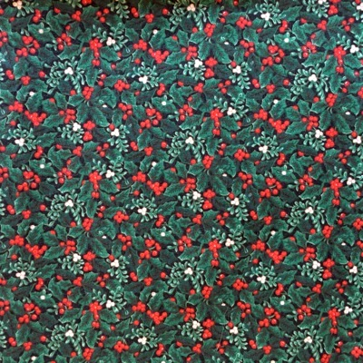 43 g / 28 sq ft = 12.25 g/sq ft + 298 g in scraps</td></tr>
	<tr><td>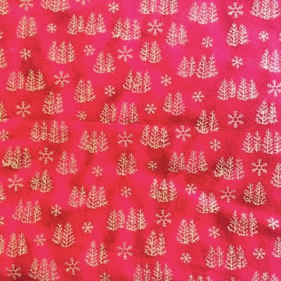 398 g / 34.3 sq ft = 11.6 g/sq ft</td>
	<td>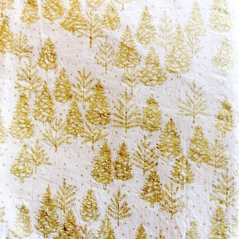 530 g / 43.2 sq ft = 12.3 g/sq ft</td></tr>
</table>