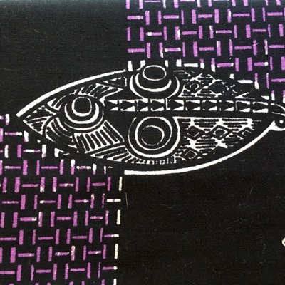

## Rug 1
<table class="table-img">
	<tr>
		<td></td>
		<td></td>
	</tr>
</table>

## Rug 2
<table class="table-img">
	<tr><td rowspan="3"><td>sq ft weight g/sq ft</td></tr>
	<tr><td colspan="3"><td>sq ft weight g/sq ft</td></tr>
	<tr><td colspan="3"><td>sq ft weight g/sq ft</td></tr>
	<tr><td colspan="3"><td>sq ft weight g/sq ft</td></tr>
</table>

## Rug 3
<table class="table-img">
	<tr><td><td>7.96 sq ft 118 14.8 g/sq ft</td></tr>
	<tr><td><td>12.0 sq ft 254 21.2 g/sq ft</td></tr>
	<tr><td><td>15.16 sq ft 358 g 23.6 g/sq ft</td></tr>
	<tr><td><td>23.8 sq ft 486 20.4 g/sq ft</td></tr>
	<tr><td><td>24.1 sq ft 391 g 16.2 g/sq ft</td></tr>
</table>

## Rug 4
<table class="table-img">
	<tr><td><td>11.0 sq ft 127 g 11.5 g/sq ft</td></tr>
	<tr><td><td>39.4 sq ft 469 g 211.9 g/sq ft</td></tr>
	<tr><td><td>sq ft 510 g g/sq ft</td></tr>
	<tr><td><td>28 sq ft 343 g< + 298 g in scraps 12.25 g/sq ft</td></tr>
	<tr><td><td>34.3 sq ft 398 g< 11.6 g/sq ft</td></tr>
	<tr><td><td>43.2 sq ft 530 g< 12.3 g/sq ft</td></tr>
</tbody>
</table>