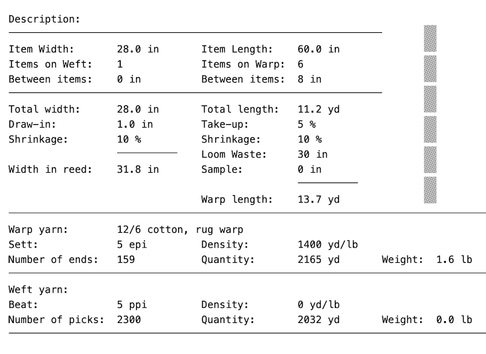

## Project planning
### Rosepath draft
{: .center-image }

### Project plan
{: .center-image }

The warp board can only handle 12 yards. Wound on in bundles of 5 from 5 cones of warp (for 5 epi).

```
5*18 = 90 + 1 to finish the pattern + 2/side for floating selvedge + 1/side to double the first pattern warp = 97 warp ends total
```

## Dressing the loom
### Winding on
3 Apr 2020: used a bamboo stick window shade to separate the layers and three 5-lb jugs of sand to weight the warp.

{: .center-image }

### Threading and tying on
* 4 Apr 2020: skip the first bundle of 5, thread 97 ends
* 5 Apr 2020: 1 warp in every other dent of a 10-dent reed. Tied on in bundles of 5, warp spread and ready to go.

## Treadlings to try


## Rugs
* [Rug 1](2020-rugs-1.html)
* [Rug 2](2020-rugs-2.html)