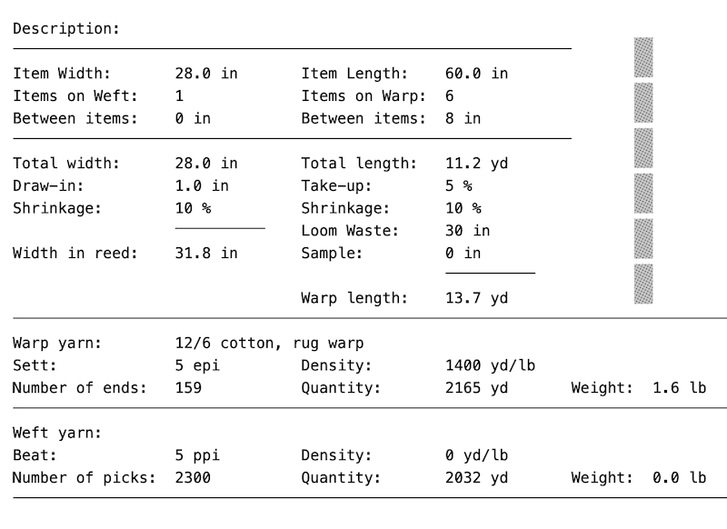
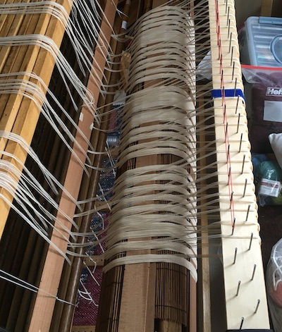
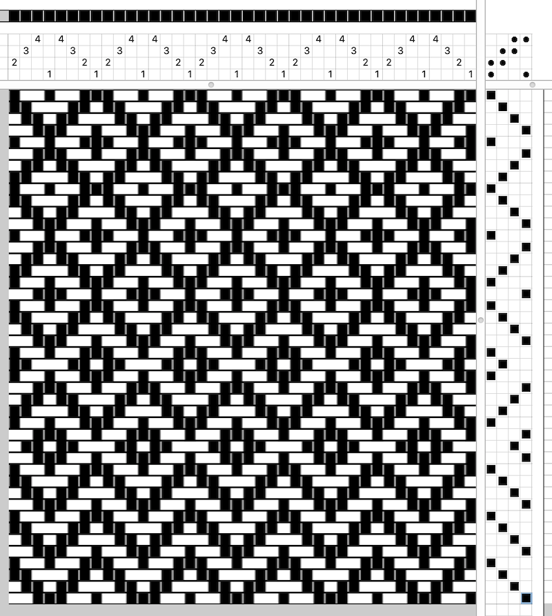
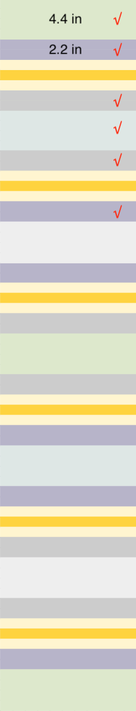

## Project planning
### Rosepath draft
{: .center-image }

### Project plan
{: .center-image }

The warp board can only handle 12 yards. Wound on in bundles of 5 from 5 cones of warp (for 5 epi).

```
5*18 = 90 + 1 to finish the pattern + 2/side for floating selvedge + 1/side to double the first pattern warp = 97 warp ends total
```

## Dressing the loom
### Winding on
3 Apr 2020: used a bamboo stick window shade to separate the layers and three 5-lb jugs of sand to weight the warp.

{: .center-image }

### Threading and tying on
* 4 Apr 2020: skip the first bundle of 5, thread 97 ends
* 5 Apr 2020: 1 warp in every other dent of a 10-dent reed. Tied on in bundles of 5, warp spread and ready to go.

## Treadlings to try


## Rug 1
* 6 Apr 2020: heading started

<div class="columns-2">
	<h2>Schematic</h2>
	
	
	<h2>Fabric weights</h2>
	<ul>
		<li>Purple 5301 sq.in./865 g = 6.13 sq.in./g → 1</li>
		<li>Blue/green 6734/685 = 9.83 sq.in./g → 1.5</li>
		<li>Blue leaves 7980/653 = 12.22 sq.in./g → 2</li>
		<li>Quilt 8010/453 = 17.68 sq.in./g → 2.5</li>
		<li>Lines 4644/354 = 13.12 sq.in./g → 2</li>
		<li>Diamonds 5818/444 = 13.10sq.in./g → 2</li>			
		<li>Orange 2968/315 = 9.42sq.in./g → 1.5</li>
	</ul>

	<h3>Width of fabric strips</h3>
	<ul>
		<li>Purple 0.75 in</li>
		<li>Blue/green 1.0 in</li>
		<li>Blue leaves 1.5 in</li>
		<li>Quilt 1.75</li>
		<li>Lines 2.0 in</li>
		<li>Diamonds 2.0 in</li>
		<li>Orange 1.0 in</li>
	</ul>
</div>