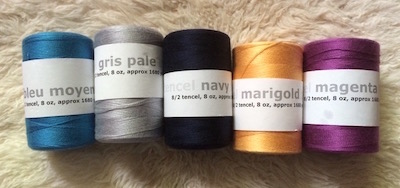
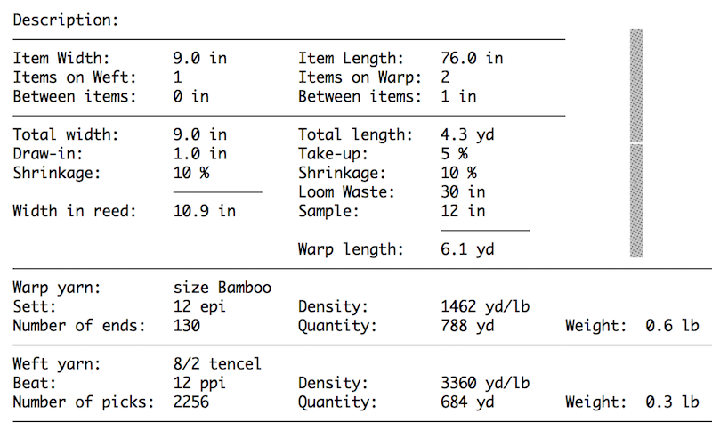
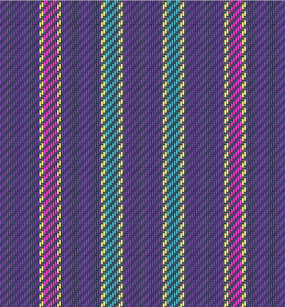
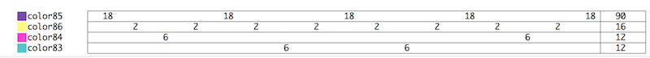
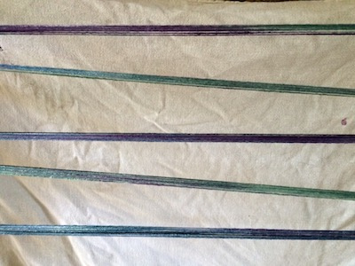
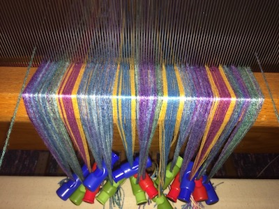
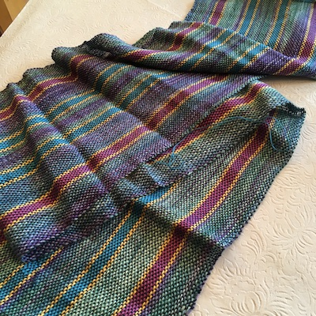
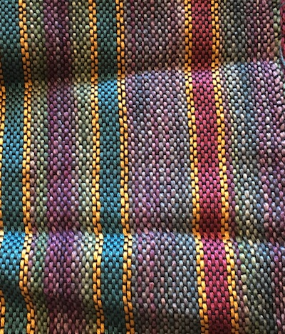

### Hand-painted bamboo for warp
From Light's Creek Studios
Greenville CA 95947

Purchased from a shop in Mineral CA.

{: .center-image }

### Tencel for warp:
8/2, 8 oz, 1680 yds, WPI = 33

### Tencel for weft:
* Navy

{: .center-image }

### Project plan

{: .center-image }
{: .center-image }

### Warp color order

{: .center-image }

### Color pooling

{: .center-image }

### Warping

{: .center-image }

### First scarf

{: .center-image }

### Off the loom

{: .center-image }

{: .center-image }
