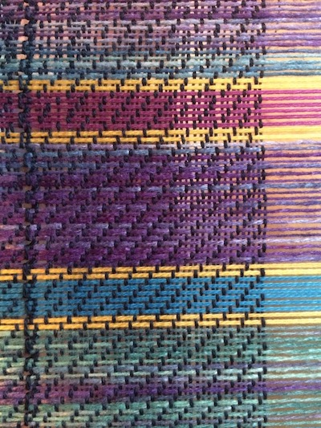

{: .center-image }

## Warp
###Hand-painted bamboo for warp
Purchased from a shop in Mineral CA.

{: .center-image }

{: .center-image }

### Tencel
8/2, 8 oz, 1680 yds, WPI = 33

{: .center-image }

## Tencel
Black

### Project plan

{: .center-image }
{: .center-image }

### Warp color order

{: .center-image }

### Color pooling

{: .center-image }

### Warping

{: .center-image }

### First scarf

{: .center-image }

### Off the loom

{: .center-image }

{: .center-image }
