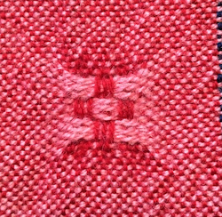

({{ page.started }}–{{ page.finished }})

## Project plan
{: .center-image }

32 balls of Jaggerspun 2/8 wool yarn, 2 oz/ball = 64 oz.
16 colors X 2 balls/color.

From Jaggerspun:

- Fiber content: 100% Wool.
- Knit gauge: 6.5 to 7 on sz 2 to 3.
- Yards/pound: 2240.
- Knitting weight: Fingering.
- Yardage/unit: 2240 yards / 1 lb cone.
- Wraps/inch: 22 (wpi).
- Weaving tabby sett: 12 to 14.
- Weaving twill sett: 15 to 18.

{: .center-image }

{: .center-image }

{: .center-image }

{: .center-image }

For each color in the weft (except navy),
45 picks x 48.7 inches/pick = 2191.5 inches x 1 yd/36 inches = 60.875 yards / 2240 yds/lb = .027 lb = .44 oz.
  Each color is repeated twice, so 0.44 oz x 2 = 0.88 oz.

Navy,
26 + (11 x 4) + 45 + (11 x 4) + 26 = 185 picks x 48.7 inches/pick = 250.26 yds / 2240 yds/lb = .1117 lb = 1.7875992 oz.

## Finished
Unwashed, 43 inches width.

After washing, no shrinkage in width.
Length, 55+28=83.

{: .center-image }
{: .center-image }
{: .center-image }

<section id="photos">

</section>