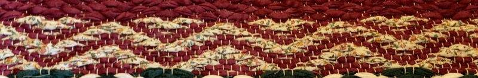
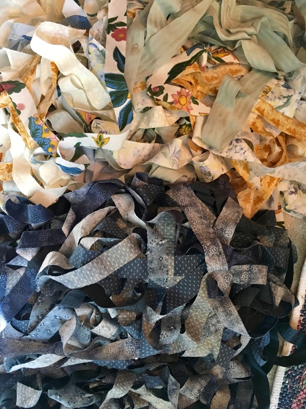
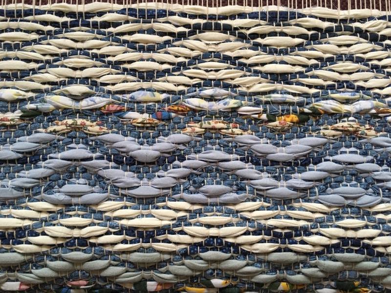
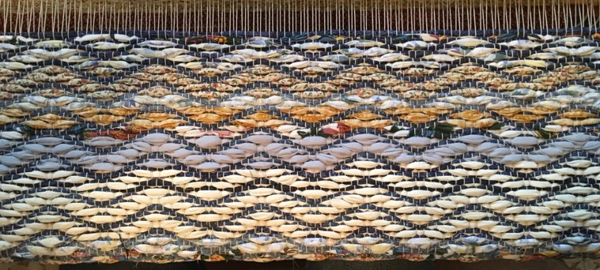
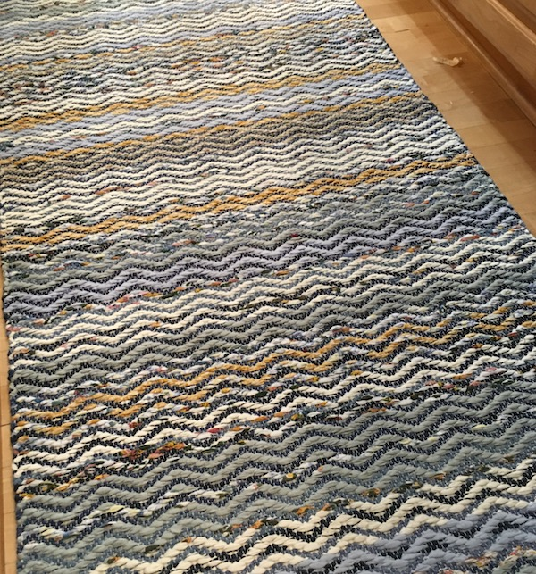

({{ page.started }}–{{ page.finished }})

A sample from the Rosepath rug class. This is twill treadling with light fabric alternating with tabby with dark fabric.

{: .center-image }

## Fabrics used
Mostly blues.

{: .center-image }

## Progress

{: .center-image }

{: .center-image }

## Finished rug

{: .center-image }